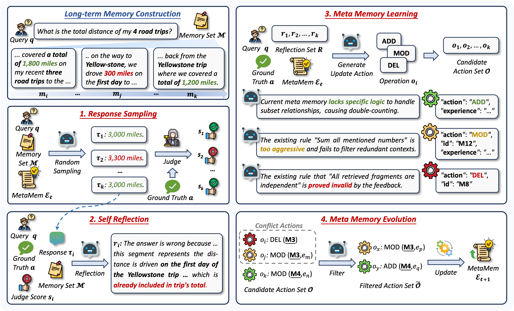

# MetaMem


## Overview

MetaMem addresses the challenge of fragmented memory and degraded reasoning in long-horizon interactions by constructing a self-evolving meta-memory framework. It iteratively distills transferable knowledge utilization experiences through self-reflection and environmental feedback, guiding LLMs to accurately extract critical evidence from scattered memory units. MetaMem demonstrates strong generalization capabilities by significantly enhancing performance in multi-session integration and temporal reasoning tasks across various retrieval-augmented architectures.



## Requirements

### 1. Create Conda Environment

```shell
conda create -n metamem python=3.11 -y
conda activate metamem
```

### 2. Install [LightMem](https://github.com/zjunlp/LightMem)

```shell
git clone https://github.com/zjunlp/LightMem.git
cd LightMem
pip install -e .
```

### 3. Pretrained LLM weights

```shell
# Qwen3-30B-A3B-Instruct
hf download Qwen/Qwen3-30B-A3B-Instruct-2507

# Qwen3-235B-A22B
hf download Qwen/Qwen3-235B-A22B

# LLMLingua2
hf download microsoft/llmlingua-2-bert-base-multilingual-cased-meetingbank

# all-MiniLM-L6-v2
hf download sentence-transformers/all-MiniLM-L6-v2
```

### 4. Deploy Model

```shell
# Qwen3-30B-A3B-Instruct
docker run -d --gpus all \
-e CUDA_VISIBLE_DEVICES=0,1 \
-v /parent_dir_to_models:/workspace \
-p 29001:29001 \
--ipc host \
--name sglang_qwen_30b \
lmsysorg/sglang:latest \
python3 -m sglang.launch_server \
--model-path /workspace/Qwen3-30B-A3B-Instruct-2507 \
--served-model-name qwen3-30b \
--host 0.0.0.0 \
--port 29001 \
--tp 2 \
--mem-fraction-static 0.85 \
--trust-remote-code

# Qwen3-235B-A22B
docker run -d --gpus all \
-e CUDA_VISIBLE_DEVICES=2,3,4,5 \
-v /parent_dir_to_models:/workspace \
-p 29002:29002 \
--ipc host \
--name sglang_qwen_235b \
lmsysorg/sglang:latest \
python3 -m sglang.launch_server \
--model-path /workspace/Qwen3-235B-A22B \
--served-model-name qwen3-235b \
--host 0.0.0.0 \
--port 29002 \
--tp 4 \
--mem-fraction-static 0.85 \
--trust-remote-code
```

## Reproduction Guide

### 1. Dataset Preprocessing

```shell
wget -c https://huggingface.co/datasets/xiaowu0162/longmemeval-cleaned/resolve/main/longmemeval_s_cleaned.json -O data/longmemeval_s_cleaned.json
```

### 2. Construct Memory

```shell
bash scripts/construct_memory.sh
```

### 3. Training MetaMem

```shell
# process train data
bash scripts/process_train_data.sh

# k-fold split
bash scripts/split_data.sh

# train
bash scripts/train_metamem.sh
```

### 4. Evaluate MetaMem

```shell
bash scripts/eval_metamem.sh
```

### 5. Inference

```shell
bash scripts/infer_metamem.sh
```

## Acknowledgement

- [LightMem](https://github.com/zjunlp/LightMem): We utilize LightMem to consturct factual memory.
- [SGLang](https://docs.sglang.io/): We utilize SGLang framework to deploy LLM serve.

## Citation

If you find this work useful, please cite our paper and give us a shining star 🌟

```bibtex
```

## Contact

For questions, suggestions, or bug reports, please contact:

```
xinhaidong@stumail.neu.edu.cn
```